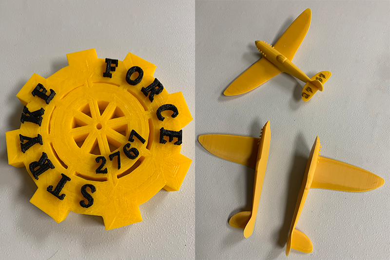

# Alliance Partner Award Event

Each year Stryke Force gives an award to our alliance partners at competitions.
This is a Stryke Force tradition that not all teams do but is fun and a good
way to graciously thank our alliance partners. We use the same award for all
competitions. Additionally, we have presented this award to a team or two at
each competition that stand out in various ways. For example; best team spirit,
best pit façade, etc.

The challenge is to design an award (about the size of your hand) that has the
Stryke Force logo or spirit or color or otherwise would be identified with the
Stryke Force brand. Pictured above are examples of awards from previous years;
one is the airplane from the Stryke Force logo which was on a pedestal, the
other used the theme of the game that year.

You have the opportunity to get creative with this challenge.
  
## Scoring

- First place: 20 points
- Second place: 15 points
- Third place: 10 points
- Fourth place: 5 points

Mentors will judge to award points
