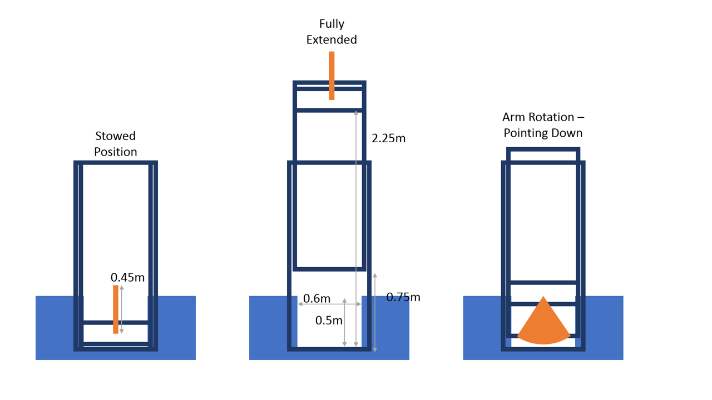
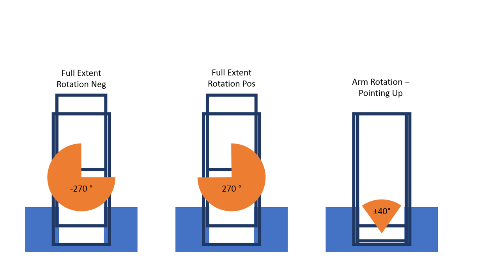

# Elevator and Arm Control Event

We utilize the WIPLib command based robot framework each season for our robots. Learning to utilize commands and command groups effectively is a key building block towards writing code for the robot. Everything action the robot takes on the field is a single command or sequence of commands working together.

<!-- START doctoc generated TOC please keep comment here to allow auto update -->
<!-- DON'T EDIT THIS SECTION, INSTEAD RE-RUN doctoc TO UPDATE -->
**Table of Contents**  

- [Elevator and Arm Control Event](#elevator-and-arm-control-event)
  - [Objectives](#objectives)
    - [**Open-Loop Operation**](#open-loop-operation)
    - [**Closed-Loop Operation**](#closed-loop-operation)
    - [**Collision/Constraint Management**](#collisionconstraint-management)
  - [Scoring](#scoring)
  - [Getting Started](#getting-started)
    - [Zeroing Axes](#zeroing-axes)
  - [Robot Configuration Details](#robot-configuration-details)
    - [Robot Sizing/Graphics](#robot-sizinggraphics)
      - [Dimensions and Max Travel Graphics](#dimensions-and-max-travel-graphics)
      - [Max Travel Graphics](#max-travel-graphics)
    - [Talons](#talons)
    - [Limit Switches](#limit-switches)
    - [Elevator Constants](#elevator-constants)
    - [Arm Constants](#arm-constants)

<!-- END doctoc generated TOC please keep comment here to allow auto update -->

# Elevator and Arm Control Event

We utilize the WIPLib command based robot framework each season for our robots. Learning to utilize commands and command groups effectively is a key building block towards writing code for the robot. Everything action the robot takes on the field is a single command or sequence of commands working together.

<!-- START doctoc-->

<!-- END doctoc-->

## Objectives

***

There are three objectives in this event, each objective increases in complexity. Each objective gives points towards winning the elevator and arm contorl event.

This repository contains the teplate project to start with. This project contains blank files for the two subsystems and classes controlling the simulation of these axes.

### **Open-Loop Operation**

This objective is focused on moving each axis under open loop control while following a few basic movement constraints. 

Add methods to the two subsystems to allow open-loop movement of the axis. Create commands that can be used to move the subsystem.

Basic Constraints

* Respect the elevator travel limits, don't go higher than the maximum height or lower than the minimum
* Don't over-wrap the arm axis. The arm can travel a maximum of 270 degrees from a straight up position in either direction

Points are awarded for respecting the constraints above and being able to move each axis through the full range of motion.

See [Getting Started](#getting-started) section for tips and resources for getting started in command-based programming.

### **Closed-Loop Operation**

When given a final position for both the arm and the elevator, move both axes to this final position. The same constraints from objective 1 still apply.

Points are awarded based on respecting the constraints and speed of moving both axes to the final position.

### **Collision/Constraint Management**

Give physical constraints related to collsions with the arm and the chassis, plan movements to avoid these collisions. You will be required to move the elevator and arm between two positions on the most efficient path.

Points are awarded based on being able to move both axes while fully respecting the collision constraints and for efficiency of the path chosen for the two axes to avoid the collision.

## Scoring

***

The following points are awarded to all participating teams in order of finish and applied towards the overall Olympics score.

1. W points
2. X points
3. Y points
4. Z points

In the case of a tie the average of the points for that place and the place one below will be awarded to both teams. For example, a tie for first place will give both teams the average of the first and second place points (N points).

## Getting Started

***

The links below point to helpful getting started docs for command-based programming. 

* WPILib documentation:
    * [Command-Based](https://docs.wpilib.org/en/stable/docs/software/commandbased/index.html?)
    * [Simulating Robot Projects](https://docs.wpilib.org/en/stable/docs/software/wpilib-tools/robot-simulation/index.html)
    * [ShuffleBoard Get Data](https://docs.wpilib.org/en/stable/docs/software/wpilib-tools/shuffleboard/layouts-with-code/retrieving-data.html)
* CTRE Documentation Basics:
    * [Open Loop Configuration](https://docs.ctre-phoenix.com/en/stable/ch13_MC.html#open-loop-features)
    * [Limit Switches and Soft Limits](https://docs.ctre-phoenix.com/en/stable/ch13_MC.html#limit-switches)
    * [Closed Loop Basics](https://docs.ctre-phoenix.com/en/stable/ch16_ClosedLoop.html)
* Java API docs:
    * [CTRE TalonSRX](https://www.ctr-electronics.com/downloads/api/java/html/classcom_1_1ctre_1_1phoenix_1_1motorcontrol_1_1can_1_1_talon_s_r_x.html)
    * [WPILib](https://first.wpi.edu/wpilib/allwpilib/docs/release/java/index.html)

### Zeroing Axes

When an axis needs to have a known location (which both the elevator and arm are in thi example), the position of that axis needs to be set as part of initializing that axis. To set that position the current absolute encoder position is compared to some known zero location (stored in the constants file) and used to set the current relative encoder position.

If the full travel of the axis is <= one full rotation of the encoder, no additional sensors are needed and the absolute encoder can be used to zero the axis. If the full travel of the axis exceeds one encoder revolution then an additional sensor is needed to determine tha the sensor is in the correct revolution to zero the axis. Both the arm and the elevator are axes for which this additional sensor is necessary. In both cases a limit switch hooked to one of the inputs of the TalonSRX is used. This limit switch returns true if the axis is in the correct location to perform zeroing. 

## Robot Configuration Details

***

The tables below contain specific configuration details for the robot as well as tuning parameters. These tuning parameters are not optimized but they are sufficient for the axis to move in closed-loop motion magic mode. The focus of this challenge is not tuning and the parameters do not need to be further optimized.

### Robot Sizing/Graphics

| Item | Dimension | Units |
| -- | -- | -- |
| Arm Length | 0.45 | m |
| Arm Max Angles | +/- 270 | deg |
| Arm Ticks per Deg | 34 | ticks/deg |
| Elevator Outer Carriage Max Ticks | 33,000 | ticks |
| Elevator Ticks per Inch | 1120 | ticks/in |
| Elevator Inner Carriage travel ratio | 2:1 | - |
| Support Structure Height | 0.5 | m |
| Support Structure Opening Width | 0.6 | m |

&nbsp;

#### Dimensions and Max Travel Graphics

#### Max Travel Graphics

&nbsp;

### Talons

| Subsystem | Type | Talon Name | ID |
| -- | -- | -- | -- |
| Elevator | SRX | elevator | 20 |
| Arm | SRX | arm | 30 |

&nbsp;

### Limit Switches

| Device Connected | FWD/REV | NO/NC | Purpose | 
| -- | -- | -- | -- |
| elevatorTalon | REV | NO | zeroing elevator |
| armTalon | FWD | NO | zeroing arm | 

&nbsp;

### Elevator Constants

| parameter | value |
| -- | -- |
| kP | 0.3 | 
| kI | 0 | 
| kD | 0 | 
| kF | 0.15 |
| motionAccel | 8000 |
| motionCruise | 4000 |
| absZeroTicks | 1000 |

&nbsp;

### Arm Constants

| parameter | value |
| -- | -- |
| kP | 1 |
| kI | 0 |
| kD | 0 |
| kF | 0.65 |
| motionAccel | 2500 |
| motionCruise | 1000 |
| absZeroTicks | 2000 |

