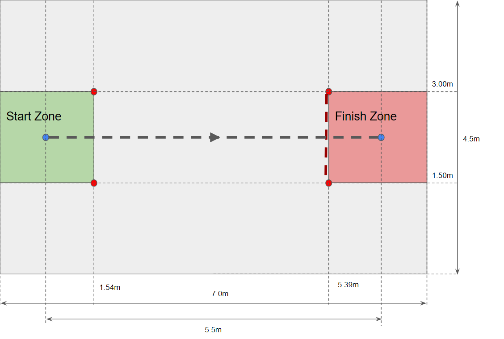
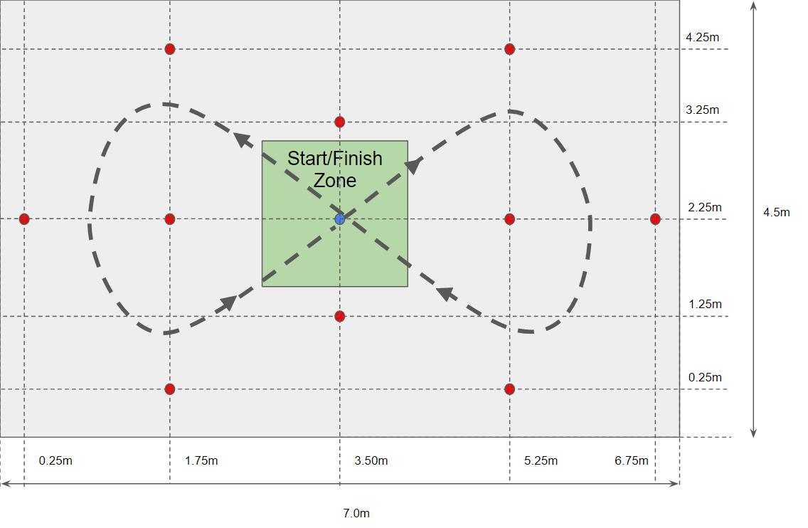
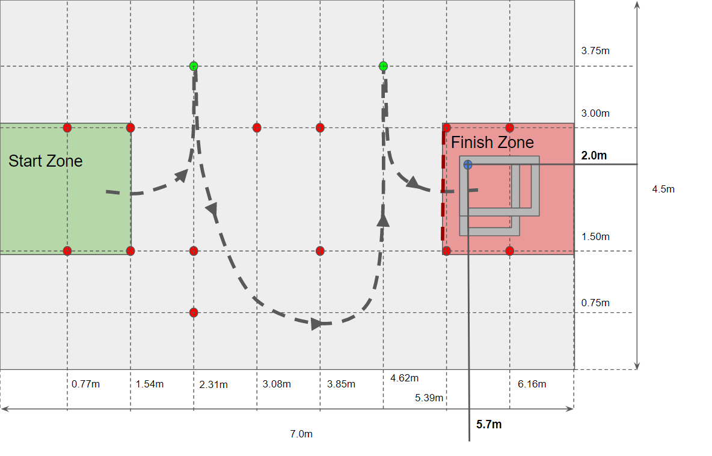

# Autonomous Pathfinding

Being able to navigate smoothly and accurately between two locations on the field completely autonomously during a match requires a couple key items: knowledge of the robot's current location on the field (odometry), a planned path (trajectory), and  a control loop to tie these two items together. This event focuses on optimizing trajectories on a couple key performances metrics: path accuracy and speed of path completion. 

<!-- START doctoc generated TOC please keep comment here to allow auto update -->
<!-- DON'T EDIT THIS SECTION, INSTEAD RE-RUN doctoc TO UPDATE -->
**Table of Contents** 

- [Objectives](#objectives)
  - [Straight Line Path](#straight-line-path)
  - [Figure Eight Path](#figure-eight-path)
  - [Bounce Path](#bounce-path)
- [Scoring](#scoring)
  - [Scoring - Penalties](#scoring---penalties)
- [Getting Started](#getting-started)
  - [TOML File Format](#toml-file-format)
  - [What is Already Implemented](#what-is-already-implemented)
- [Bonus: *"the why"* -  Auton Highlight Reel](#bonus-the-why----auton-highlight-reel)

<!-- END doctoc generated TOC please keep comment here to allow auto update -->

## Objectives

There are three separate path objectives in this event, each path increases in complexity and gives points towards winning the autonomous pathfinding event. 

This repository contains the template project to start with. For the purposes of this event the focus is only on the trajectory tuning portion of the autonomous pathfinding, because of this the template project has a couple key items already present in the project:

* A method to read in trajectory waypoints from toml files
* A path drive command complete with a tuned holonomic control that can drive an input trajectory
* Odometry in the drive subsystem to keep track of the robot's current location

To complete the event all a team needs to do is create toml files with trajectory waypoints and feed this trajectory into the existing path drive command and show that the robot can successfully drive the given path. In order to increase their score the following are some ways that a team may optionally modify the existing code to attempt to increase accuracy/speed:

* Adding in constraint regions as necessary to allow some portions of the trajectory to be manually controlled to be slower
* Modifying the tuning in the existing holonomic controller to try and ensure greater accuracy at higher speeds
* Modifying the robot heading along the path using a profiled PID controller if doing so allows higher speed/accuracy

### Straight Line Path

This objective involves driving a simple 5.5m straight-line path as fast and accurately as possible. There are markers at the beginning and end of the path and hitting these markers constitutes a penalty. The start position of the robot is marked and the final distance is measured to calculate the distance error vs a 5.5m goal. The robot must start and end fully within the designated zones. For more details on scoring see: [scoring](#Scoring)

### Figure Eight Path

This objective involves driving a figure eight path starting and ending in the same spot in the center of the figure eight. There are markers throughout the path to constrain the robot and any markers hitting any of these constitues a penalty. Additionally, the start position is marked and the distance between the end position and this start position is measured for a distance error. The robot must start and end fully within the designated zone. For more scoring details see: [scoring](#Scoring)

### Bounce Path

This objective involves driving a path that intentionally hits two markers before ending in a specified location. Hitting any of the markers indicated red in the picture below earns a penalty. Not hitting the green colored markers is also a penalty. The robot must start/end in the designated zones. For more scoring details see: [scoring](#Scoring). The final distance error is measured between the location marked with a blue dot in the image below and the wheel closest to that corner (which wheel pod this is will change depending on the orientation of the robot as it follows the trajectory)

## Scoring

The following points are awarded to all participating teams in order of finish and applied towards the overall Olympics score.

1. 20 points
2. 15 points
3. 10 points
4. 5 points

In the case of a tie the average of the points for that place and the place one below will be awarded to both teams. For example, a tie for first place will give both teams the average of the first and second place points (17.5 points).

### Scoring - Penalties

For all 3 objectives the following penalties apply:
- Hitting a Red Marker: 3sec penalty per marker
- Not Hitting a Green Marker: 5sec penalty per marker
- For every 5cm of error: 1sec penalty

The final score is the measured time for the run with all three sets of penalties added to it. If a team does not complete all 3 paths, any paths without a timed run are awarded 60sec by default. The team with the lowest overall time is awarded the first place points listed above and so on. 

## Getting Started

We utilize the swerve drive odometry and kinematics as well as the trajectory generation classes that are part of the WPILib libraries. For more background information on kinematics, odometery, path following, and swerve drive math see the links below:
- [Swerve Presentation](https://strykeforce.github.io/classroom/swerve/#/title-slide)
    - [Swerve Motion](https://strykeforce.github.io/classroom/swerve/#/swerve-drive-motion)
    - [Swerve Math](https://strykeforce.github.io/classroom/swerve/#/swerve-math)
    - [Swerve Software](https://strykeforce.github.io/classroom/swerve/#/swerve-software)
    - [Trajectory Following](https://strykeforce.github.io/classroom/swerve/#/trajectory-following)
- [WPILib Odometry and Kinematics](https://docs.wpilib.org/en/stable/docs/software/kinematics-and-odometry/index.html)
    - [Swerve Kinematics](https://docs.wpilib.org/en/stable/docs/software/kinematics-and-odometry/swerve-drive-kinematics.html)
    - [Swerve Odometry](https://docs.wpilib.org/en/stable/docs/software/kinematics-and-odometry/swerve-drive-odometry.html)
- [Trajectory Generation and Following](https://docs.wpilib.org/en/stable/docs/software/advanced-controls/trajectories/index.html)
    - [Generation](https://docs.wpilib.org/en/stable/docs/software/advanced-controls/trajectories/trajectory-generation.html)
    - [Constraints](https://docs.wpilib.org/en/stable/docs/software/advanced-controls/trajectories/constraints.html)
    - [Manipulate Trajectory](https://docs.wpilib.org/en/stable/docs/software/advanced-controls/trajectories/manipulating-trajectories.html)
    - [Holonomic Controller](https://docs.wpilib.org/en/stable/docs/software/advanced-controls/trajectories/holonomic.html)

Some other helpful resources for troubleshooting/completing the challenges include:
- Grapher - Several items in the drive subsystem are graphable for easy debug:
    - Odometry
    - Sampled Trajectory State
    - Holonomic Controller Output 
- The template project is designed to read-in waypoints from a toml file but teams may find it useful to use Pathweaver to set initial path waypoints:
    - zip files containing the JSON files and field images are in the **docs folder**
    - follow the instructions in [WPILIB readthedocs](https://docs.wpilib.org/en/stable/docs/software/wpilib-tools/pathweaver/adding-field-images.html) to add these images to the field options in pathweaver.
    - There is already a pathweaver project in this directory - just import it
    - In order to use the existing code you don't want to build and use pathweaver directly - instead look at the waypoints listed in the .path file in the *PathWeaver/Paths* folder and copy these into the TOML file format below
    - The origin location is already corrected to be bottom left for the olympics field images in pathweaver, so you should be able to directly copy the x,y locations

### TOML File Format

An [example TOML file](./src/main/deploy/paths/examplePath.toml) has been provided to show proper file formatting. Key information in the file is as follows:
- **Starting Pose:** the x and y position of the starting waypoint (in meters) and the robot angle at that position (in degrees)
    - The angle for this pose is easiest to think about when considering a tank drivetrain - this is the angle of the wheelbase at the start of this trajectory. The heading of the swerve drive (gyro angle) throughout the trajectory is controlled by the `targetAngle` input in the `DriveTrajectoryCommand` - a swerve can have a heading completely independently of the wheelbase angle
- **Ending Pose:** the x and y position of the ending waypoint (in meters) and the robot angle at that position (in degrees). See description above for how to choose angle.
- **Internal Points:** a list of x and y positions (in meters) for each interior waypoint
- **Max Velocity:** the maximum velocity (in m/s) for this particular path - cannot be faster than the maximum robot velocity in constants file (3.5m/s) can be slower in order to slow down the path for accuracy
- **Max Acceleration:** the maximum acceleration (in m/s/s) for this particular path
- **Start Velocity:** The starting velocity (m/s) for this path - will often be 0m/s unless this path is linked to some previous path that has some exit velocity
- **End Velocity:** The end velocity (m/s) for this path - will often be 0m/s unless this path is exiting to some other activity where continuing movement is necessary
- **Is Reversed:** A boolean value indicating whether the direction of robot travel is backwards 
    - The easiest way to decide whether this must be `true` or not is to think of if a tank drive was driving this path, would the wheels need to rotate forward or backwards

### What is Already Implemented

**DriveSubsystem.java**
- Swerve drive already created and configured to work with Jiff chassis
- Talon and Falcon configs already applied (including current limiting and PID tuning)
- Method to read in trajectory TOML file given a filename and return a generated trajectory provided
- Method to update the Holonomic controller outputs (given a desired state) and apply this new output to the swerve
- Registering basic helpful kinematics, odometry, and holonomic controller info to grapher

**DriveTrajectoryCommand.java**
- Takes input trajectory filename and calculates trajectory
- Timer implemented to keep track of where to sample trajectory file and when to stop path
- Take in a desired heading (accounts for only a single heading through the whole path) and feeds into holonomic controller
- Calls to update holonomic controller/swerve outputs each robot loop

**RobotContainer.java**
- Joystick/subsystems created
- Enums to map Interlink controller added
- Default command for driveSubsystem (telop swerve driving) implemented
- Reset gyro button (refresh button)
- Reset odometry button (hamburger button)
- Run DriveTrajectoryCommand for example path button (X button)

**Constants.java**
- Talon/Falcon Config parameters
- All swerve drive config parameters
- Holonomic controller config parameters

## Bonus: *"the why"* -  Auton Highlight Reel

Here are some example videos showing the variety in auton routines between years (and within years) to show why this is useful:

- [2021 Skills - Barrel](https://www.youtube.com/embed/8gkZXhZDnAw?start=3&end=14)
- [2021 Skills - Slalom](https://www.youtube.com/embed/QbjR8OJcM3I?start=3&end=12)
- [2021 Skills - Bounce](https://www.youtube.com/embed/G-ClUh2m79U?start=3&end=15)
- [2020/2021 Collect and Shoot Balls](https://www.youtube.com/embed/qYgKP4BkrWQ?start=0&end=15)
- [2019 Collect and Deliver Hatches](https://drive.google.com/file/d/1Di4FLQylQ57y_J3jnK4qn4M0Ml6Efx9n/view?usp=sharing)
- [2018 Opposite Side Scale](https://www.youtube.com/embed/II32Rxm3th8?start=6&end=22)
- [2018 Same Side Scale](https://www.youtube.com/embed/3G9fM5l-c40?start=3&end=19)
- [2018 2.5 cube Switch](https://www.youtube.com/embed/IQTwmX5lpn0?start=6&end=22)
- [2017 Deliver Gear and Shoot](https://www.youtube.com/embed/p27aOiNgbos?start=5&end=25)
- [2016 Cross Defense and Shoot](https://www.youtube.com/embed/X92sm-670sM?start=4&end=20)

