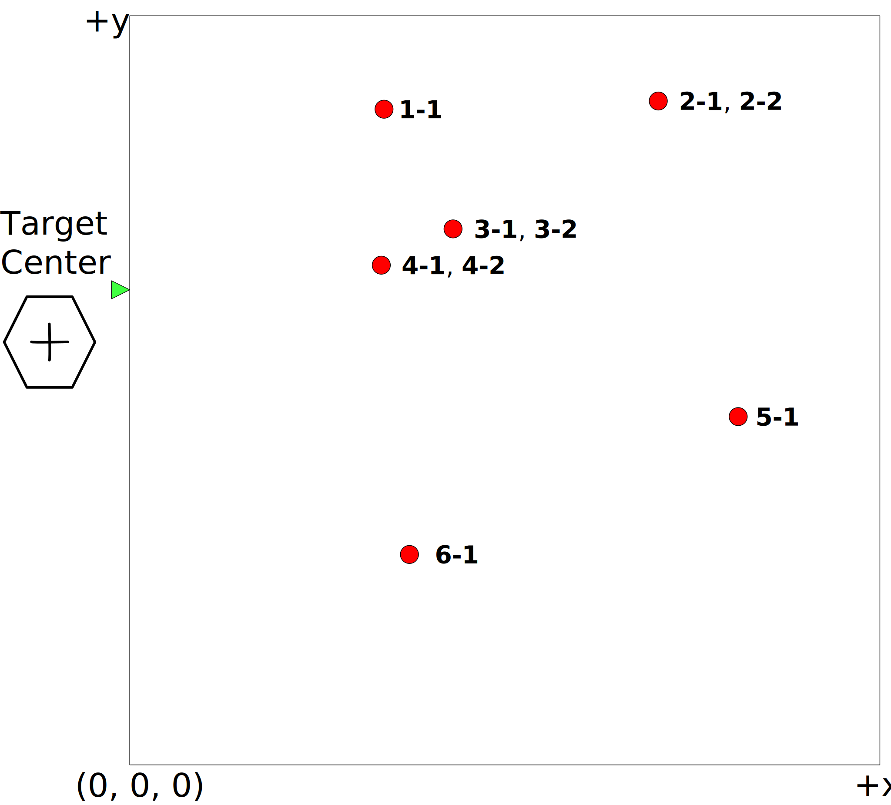
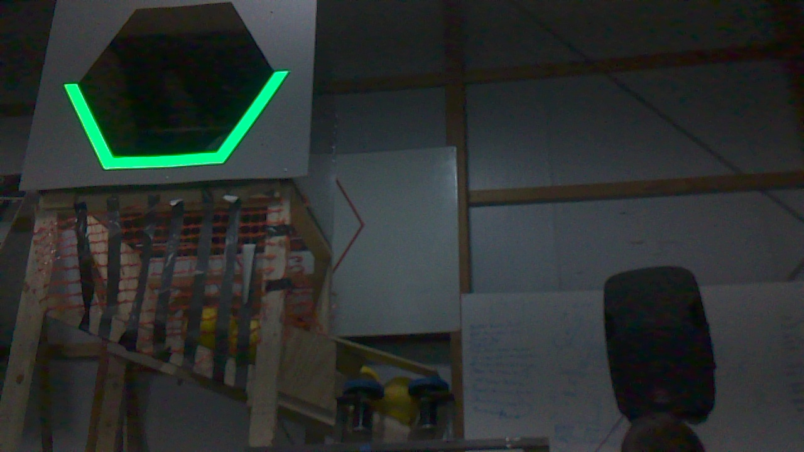
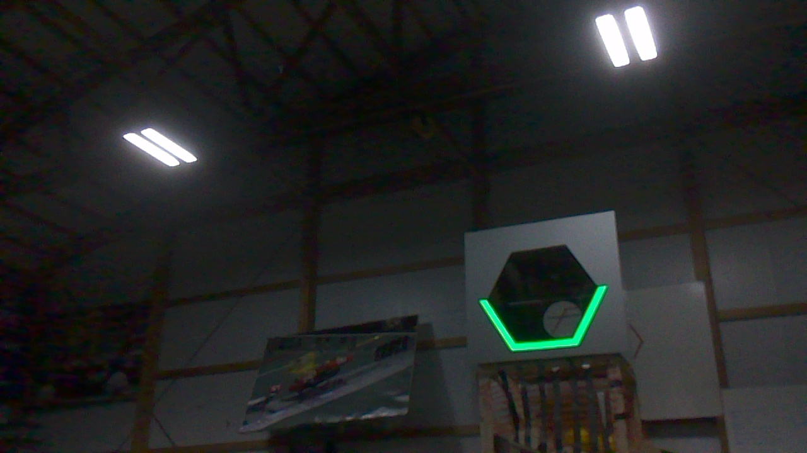
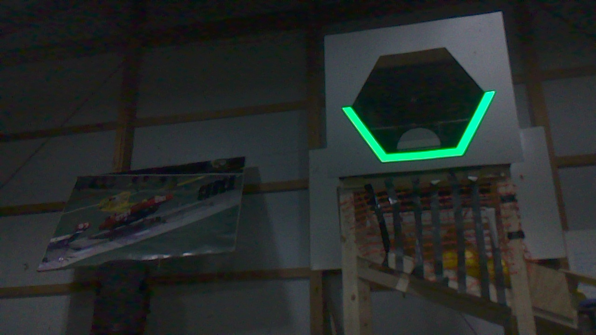
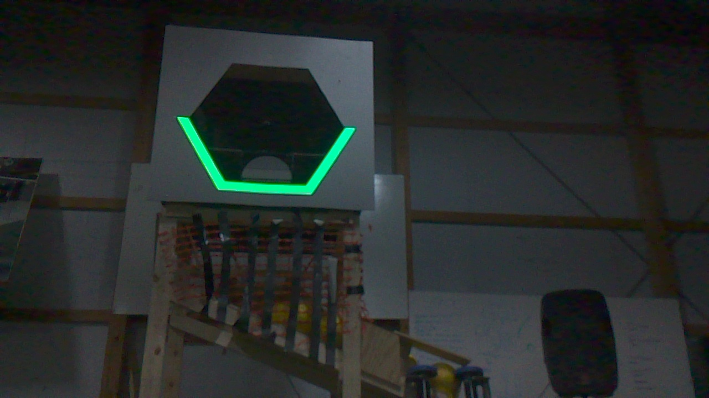
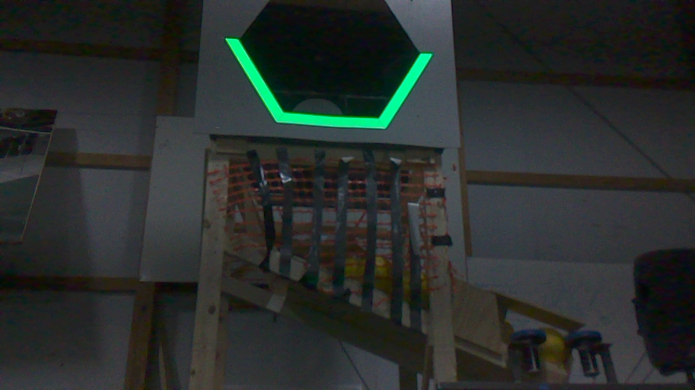
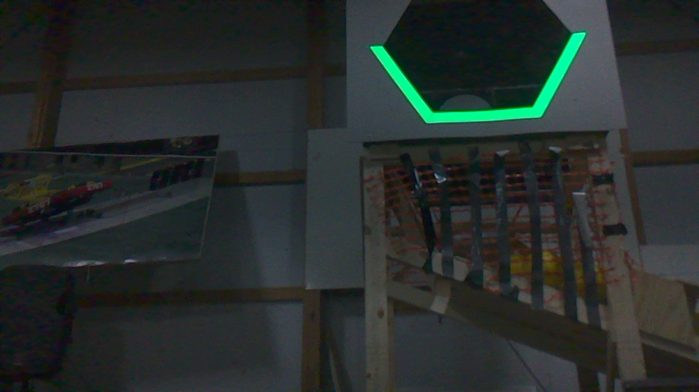
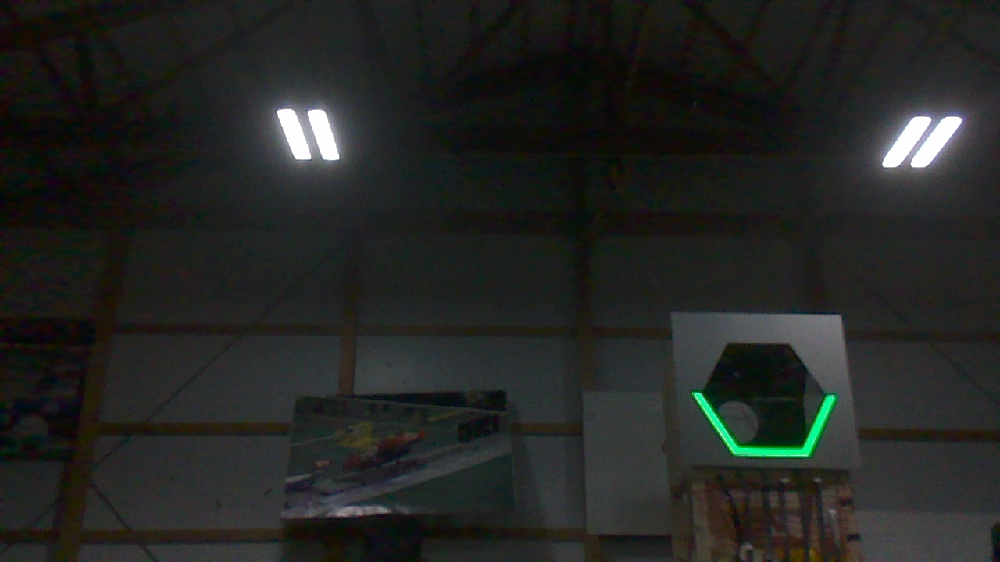
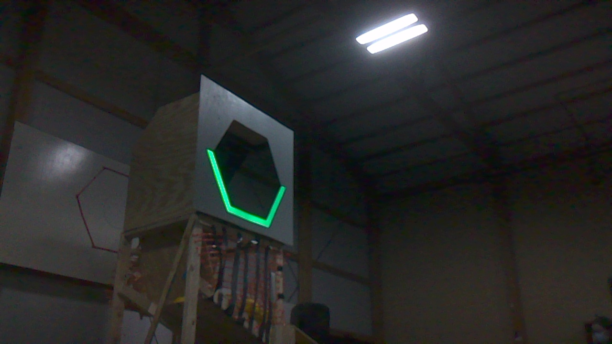

# Vision Samples

Sample images for the [Computer Vision](../README.md) event.

## Field Coordinates

This folder provides sample target images taken with the Deadeye system from
the following locations.

The **center of the target** is located at:

- x = 0 cm
- y = 584 cm
- z = 249 cm

## Target Image Data

| Image | Name | x (cm) | y (cm) | z (cm) |
| ----- | ---- | ------ | ------ | ------ |
|  | 1-1.jpg | 280 | 723 | 30 |
|  | 2-1.jpg | 582 | 732 | 30 |
|  | 2-2.jpg | 582 | 732 | 30 |
|  | 3-1.jpg | 356 | 591 | 30 |
|  | 3-2.jpg | 356 | 591 | 30 |
|  | 4-1.jpg | 277 | 551 | 30 |
|  | 4-2.jpg | 277 | 551 | 30 |
|  | 5-1.jpg | 670 | 384 | 30 |
|  | 6-1.jpg | 308 | 232 | 30 |

